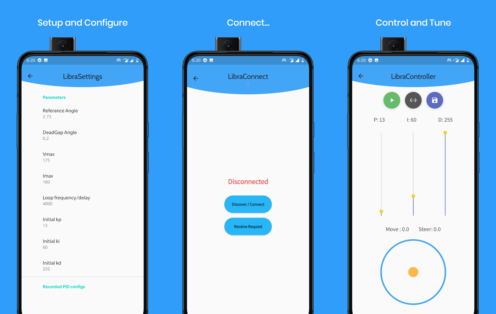

# A two wheeled Self-Balancing robot project

This is a self balancing robot project that includes:
* arduino code
* CoppeliaSim simulation 
* an android app used to control the robot

## Android app screenshots

## Demo video

## Simulation video

